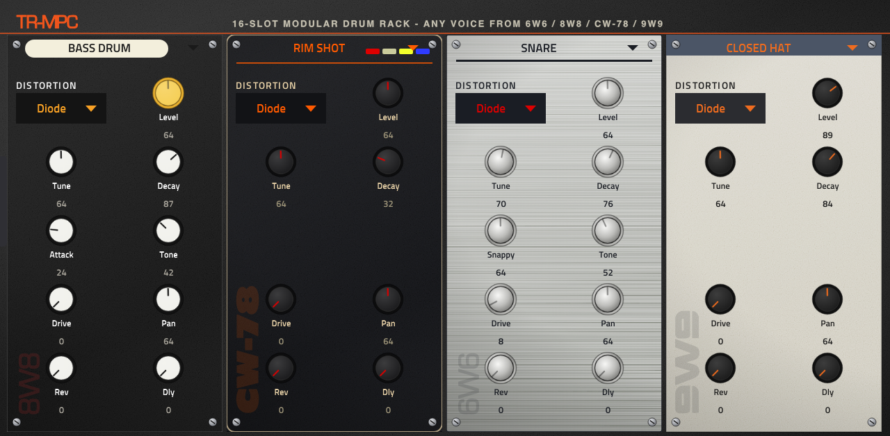
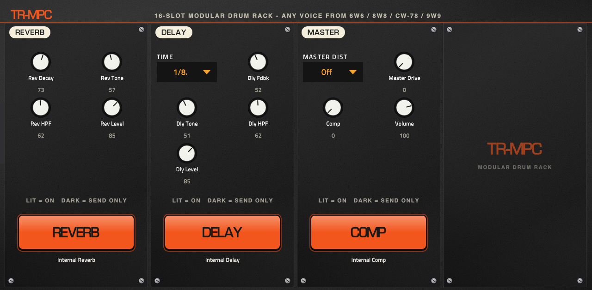
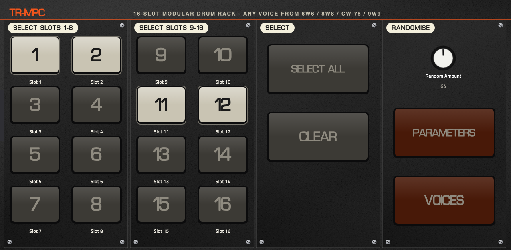
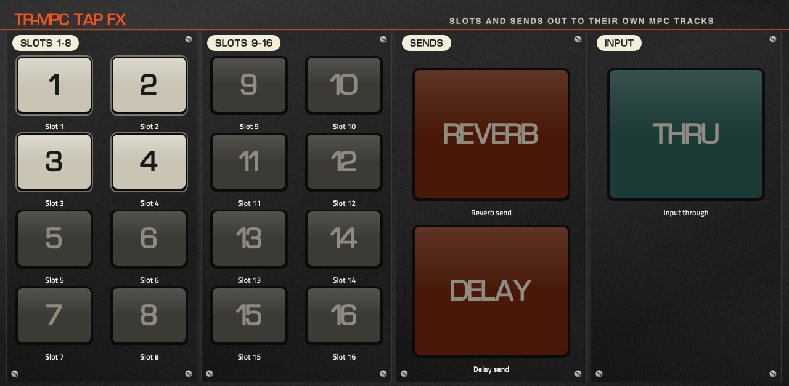

# mpc-vst-TR-MPC

💬 Questions or feedback? Join the [Open MPC Discord](https://discord.gg/sRRysZSgu3).

> **MPC OS.** The 6W6, 8W8, CW-78 and 9W9 releases from 1.1.1 are built for **MPC OS 2.x and 3.x**: the plugin library needs glibc 2.32 or less
> and the skin uses the version 2.15.1's own skins use (the [catalog](https://sd88me.github.io/mpc-vst-plugins/) checks both). They are tested on
> MPC OS 3.x (a Force); **not yet tested on a 2.x unit**, so the catalog does not show them as tested on 2.x. TR-MPC itself still works on MPC OS 3.x only.
> See [MPC OS 2.x vs 3.x](https://github.com/sd88me/mpc-vst-plugins#mpc-os-2x-vs-3x) in the main repo.

Four classic drum machines, and a modular kit that combines them, as native VST2 plugins for Akai MPC OS standalone devices (Force, MPC Live / Live II, One, X, Key 61), each with its own MPC touchscreen skin and Q-Link mapping:

| Plugin | Models | Voices | Install |
|---|---|---|---|
| **TR-MPC** | All four machines in one 16-slot kit | 49 voices, any voice on any of 16 pads | [latest TR-MPC release](../../releases?q=trmpc-vst) |
| **TR-MPC Tap FX** | Companion effect for TR-MPC | Sends any slot or the reverb/delay send to its own MPC track | [latest Tap FX release](../../releases?q=trmpc-tap-fx-vst) |
| **6W6** | Roland TR-606 | 8 | [latest 6W6 release](../../releases?q=6w6-vst) |
| **8W8** | Roland TR-808 | 16 | [latest 8W8 release](../../releases?q=8w8-vst) |
| **CW-78** | Roland CR-78 CompuRhythm | 14, plus 17 preset rhythm buttons | [latest CW-78 release](../../releases?q=cw78-vst) |
| **9W9** | Roland TR-909 | 11 | [latest 9W9 release](../../releases?q=9w9-vst) |

## These are straight ports

All the sound design is by **athousanddetails**, who wrote the original [Schwung](https://github.com/charlesvestal/schwung) modules for Ableton Move: [schwung-6W6](https://github.com/athousanddetails/schwung-6W6), [schwung-8W8](https://github.com/athousanddetails/schwung-8W8), [schwung-cw-78](https://github.com/athousanddetails/schwung-cw-78) and [schwung-9W9](https://github.com/athousanddetails/schwung-9W9). Their DSP is vendored here **unmodified** (`ports/<kit>/src`, with the upstream commit recorded in each `VENDORED.md`), so the kits sound the way the originals do and the plugins keep athousanddetails as manufacturer.

What this repo adds is only the MPC side:
- the VST2 wrapper and parameter list, via the Schwung adapter in [mpc-vst-plugins](https://github.com/sd88me/mpc-vst-plugins);
- an MPC touchscreen skin and Q-Link pages per kit (`layout.conf`);
- a remap of the MPC drum-pad MIDI notes (0-15) onto each kit's own voice map, so the pads of an MPC drum program play the right drums;
- build, offline test and release automation.

Please support and credit the original author. Everything is GPL-3.0, as upstream.

## What the drum plugins do

6W6, 8W8, CW-78 and 9W9 share the same design. Every voice is synthesised (9W9 also uses three samples, below). Every continuous control is a 0-127 pot like the hardware, and every voice has Tune, Decay, Drive, a distortion type, Level and, except the kick, Reverb and Delay sends.

- **Seven distortion characters** per voice and on the master bus: Diode, Clip, SAT, BFZ, PDIST, Fold, Crush. Drive fully down is exactly dry.
- **Send FX**: a reverb (combs and allpasses with a 12-bit loop) and a tempo-synced delay (note divisions, slewed like tape). Both are silent at zero.
- **Master**: master distortion and drive, a one-knob bus compressor (hard bypass at zero), volume, velocity depth and hat choke options.
- **Velocity** plays: the loudest hit is always the top level, and the Velocity control sets how far softer hits fall below it.

### 6W6, TR-606
Eight voices, fitted against recordings of a real TR-606: bass drum, snare (with a Decay control), low and high tom, closed and open hat, cymbal, plus a hand clap on the spare pad. The hats and cymbal use banks of measured partials from hardware. Kick Attack goes from a softened onset to the original punch. Hat choke is a switch (Off, CH cuts OH, Mutual).

### 8W8, TR-808
Sixteen voices. Fifteen are circuit models built from the service notes: a bridged-T bass drum where Decay is loop gain, two-shell snare, low/mid/hi tom and conga, claves, maracas, hand clap, cowbell, hats and cymbal. The cowbell, both hats and the cymbal share one free-running metal oscillator bank like the hardware. The rim shot is a transcription of Sonic Pi's sc808. It fills all 16 pads.

### CW-78, CR-78 CompuRhythm
Fourteen voices modelled from the 1979 service notes and Roland's factory alignment figures: kick, snare, low/hi bongo, low conga, rim shot, claves, hi-hat, cymbal, maracas, cowbell, tambourine, guiro and the Metallic Beat. The machine's **preset rhythms** are included, transcribed from the service notes: 17 buttons with an A/B lever (34 rhythms), and a second button can be combined with the first as on the hardware. They play from the MPC transport on the Rhythm page.

### 9W9, TR-909
Circuit-modelled kick, snare, three toms, rim shot and hand clap; **sampled** hi-hats, ride and crash, the same split the real 909 used. The cymbal samples ship with the plugin (`engine/samples/` next to the `.so`) and come from [ER-99](https://github.com/matthewcieplak/er-99), GPL-3.0. Accent sets the full-velocity level; closed and open hat choke each other.

## Install

Needs a first-generation MPC OS standalone with root SSH (a modded unit). Take the zip from the plugin's release, unzip it, copy the folder to the device and run `install.sh` (it stops MPC, so save first):

```
scp -r 6W6-1.1.1 root@<device-ip>:/tmp/
ssh root@<device-ip> sh /tmp/6W6-1.1.1/install.sh
```

(`TR-MPC-1.0.0` and `TR-MPC-Tap-FX-1.0.0` work the same way. TR-MPC's zip is about 20 MB; if copying the unzipped folder over a flaky network is a problem, `scp` the zip, unzip it on the device and run `sh install.sh -y`.)

Then add the plugin to a track from the plugin browser: the drum machines and TR-MPC are Instrument plugins, Tap FX is an Insert effect. `INSTALL.md` in each zip has the manual steps and `uninstall.sh` removes it. The installer stops MPC (save first), backs up `MPC.settings` and upgrading in place keeps your own files. Tested on a Force. Installing plugins this way is unofficial, so back up first.

## CPU (Force, one core, 44.1 kHz / 128 frames, 16 voices)

| Plugin | p99 | Worst block | Verdict |
|---|---|---|---|
| 6W6 | 30.9% | 31.6% | WARN: one or two instances per project |
| 8W8 | 13.1% | 13.6% | PASS |
| CW-78 | 7.7% | 9.0% | PASS |
| 9W9 | 21.2% | 22.9% | WARN: one or two instances per project |
| TR-MPC | 24.8% | 27.4% | WARN: one instance per project (an idle engine or the FX stage sleeps after 5 s of silence) |

## Status

- **TR-MPC 1.0.0** and **TR-MPC Tap FX 1.0.0** are released (MPC OS 3.x; tested on a Force, MPC OS 3.9.1.2).
- 6W6, 8W8, CW-78 and 9W9 are at 1.1.1 (MPC OS 2.x skin shape, readable menu pickers, FX/MASTER page, host transport and tempo for the kits); not yet tested on a 2.x unit.
- The drum-machine skins are auto-generated layouts (palette from the original web UIs). Their knob caps and plates are drawn, but the web UIs' sequencer and pad strip are not reproduced.
- Not yet checked by ear: the pad-to-voice mapping against every MPC drum-program layout.
- Not yet auditioned at length on the device: TR-MPC Tap FX routing on every combination of slot, send and `THRU`.

## TR-MPC

One modular drum kit that combines all four machines: **16 pad slots, where each slot picks any of the 49 voices** from 6W6 (8), 8W8 (16), CW-78 (14) and 9W9 (11): a 606 kick next to an 808 snare and 909 hats, say. It reuses the same engines, so the sound stays the original author's: `ports/<kit>/src` is byte-identical to upstream, and the kit build only adds a small per-voice output tap to a patched copy so each voice can be panned, sent and mixed separately.



### Playing it
- Slots 1-16 answer MIDI notes **36-51** (the standard MPC drum-pad range), or notes 0-15 with the optional drum-pad patch below. Velocity works as on the drum plugins.
- Add TR-MPC to a track as an instrument; each pad of an MPC drum program triggers its slot. Every slot starts with a ready default voice (bass drum, snare, toms, hats, clap, rim, cowbell and so on), so it plays as a kit straight away.
- Two slots set to the same voice share that engine voice (one is retriggered by the other); they can still differ in pan and sends, and the slot you hit last is the one you hear.
- Project recall: all slot values, FX settings and the randomise setup are saved with the project.

### Slot pages (Q-Link)
Each slot has one page of 16 knobs. The panel **reskins itself to the kit of its voice** (6W6 silver, 8W8 charcoal, CW-78 black and wood, 9W9 cream), with the voice name as a menu at the top (grouped and coloured per kit). Every slot has:
- **Voice** (49 choices), **Distortion** type (the seven characters: Diode, Clip, SAT, BFZ, PDIST, Fold, Crush), **Level**, **Tune**, **Decay**, **Drive**;
- the voice's own controls where it has them (Attack, Tone, Snappy, Noise, Rate, Sweep and so on: only those the voice owns are shown);
- **Pan** (constant power) and **Rev** / **Dly** sends into the shared effects.

Continuous knobs are 0-127 and the jog wheel and Q-Links nudge them in fine steps.

### FX page
Three modules with a lit / dark key each: **REVERB** (decay, tone, high-pass, level), **DELAY** (tempo-synced time, feedback, tone, high-pass, level) and **MASTER** (master distortion and drive, a one-knob bus compressor, volume). One reverb, one delay and one master chain serve all 16 slots, followed by an output soft limiter so sixteen pads summed together do not hard-clip. The key lit means the kit's own stage is in the signal path; dark means **send only**: the stage is bypassed and that send leaves only through a Tap FX (below).



### Randomise page
Grey keys select slots (or **SELECT ALL** / **CLEAR**), **Random Amount** says how far to move things, **PARAMETERS** randomises the selected slots' controls and **VOICES** also swaps each to another voice of the same kit. Level is never touched, so a random kit never jumps in volume.



### TR-MPC Tap FX
A companion effect plugin for routing parts of the kit through MPC's own mixer. Put it on an MPC track as an insert, switch on any slots and/or the reverb or delay send, and that track receives them, sample-aligned with the kit (one block of latency, about 3 ms), so MPC's mixer, submixes and insert effects can process them. A slot a tap reads leaves TR-MPC's own main mix; a send a tap reads stops feeding TR-MPC's own reverb or delay (and the **dark / send only** keys above turn the internal stages off entirely). **THRU** adds the effect's own input. **Both plugins must be in the same project.**



### Limits
- MPC OS 3.x only for TR-MPC and Tap FX, for now.
- About 20 MB installed and about 1,100 skin components: the pages load a little slowly and memory is tighter than the drum plugins (watch it with many other add-ons running).
- CPU: see the table above. Use one TR-MPC per project.
- Only Level, Tune, Decay, Drive, Distortion and the nine extra voice pots are saved per slot; other internal pots of an engine keep their defaults.

## Building

Needs Docker and a sibling checkout of [mpc-vst-plugins](https://github.com/sd88me/mpc-vst-plugins), in a path without spaces:

```
bash tools/build_ci.sh 9w9      # armhf .so + skin in ports/9w9/build
bash tools/test_ci.sh 9w9       # offline ASan/UBSan host test
```

`tools/extract_module.py` builds `module.mpc.json` (chain_params and ui_hierarchy) from a kit's generated `*_params.h`; `tools/build_all.sh` builds everything and renders skin previews. TR-MPC builds with `bash tools/build_ci.sh trkit full` and its offline tests are `bash ports/trkit/test/run.sh`; `tools/package_trmpc.sh <version> <dist> [device-ip]` packages and installs it and Tap FX locally. Releases: Actions, "Release <kit> (draft)" (`.github/workflows/release-<kit>.yml`, tags `<kit>-vst-v<version>`; TR-MPC and Tap FX share `release-trmpc.yml`), then install the draft's zip on a device, smoke-test it and publish. `patch/` holds an experimental MPC OS drum-pad patch.

## Credits and licence

Sound design, DSP and the original modules: **athousanddetails**. 9W9's cymbals and early engine: Matthew Cieplak's ER-99. 8W8's rim shot: Sonic Pi's sc808. Schwung is by Charles Vestal. Not affiliated with or endorsed by Roland or Akai; TR-606, TR-808, CR-78 and TR-909 are Roland trademarks, used only to describe what is modelled. GPL-3.0, see `LICENSE`.

## Optional drum-pad firmware patch
Not part of any plugin release. A standalone script ([`tools/mpc_patch/mpc-drum-pad-patch.sh` in mpc-vst-plugins](https://github.com/sd88me/mpc-vst-plugins/tree/main/tools/mpc_patch); a development copy is in `patch/`) gives 6W6, 8W8, CW-78, 9W9, TR-MPC and Machinedrum Module the 16-pad drum layout on MPC OS 3.9.1.2. It modifies Akai's factory MPC program; read its README first.
